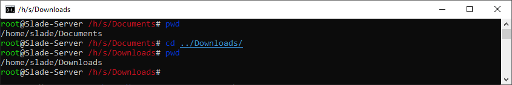
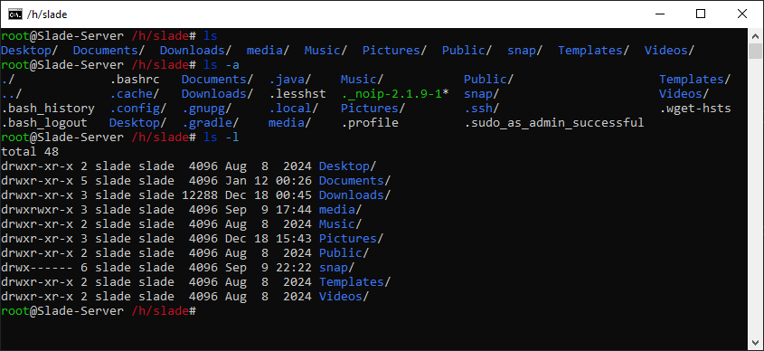
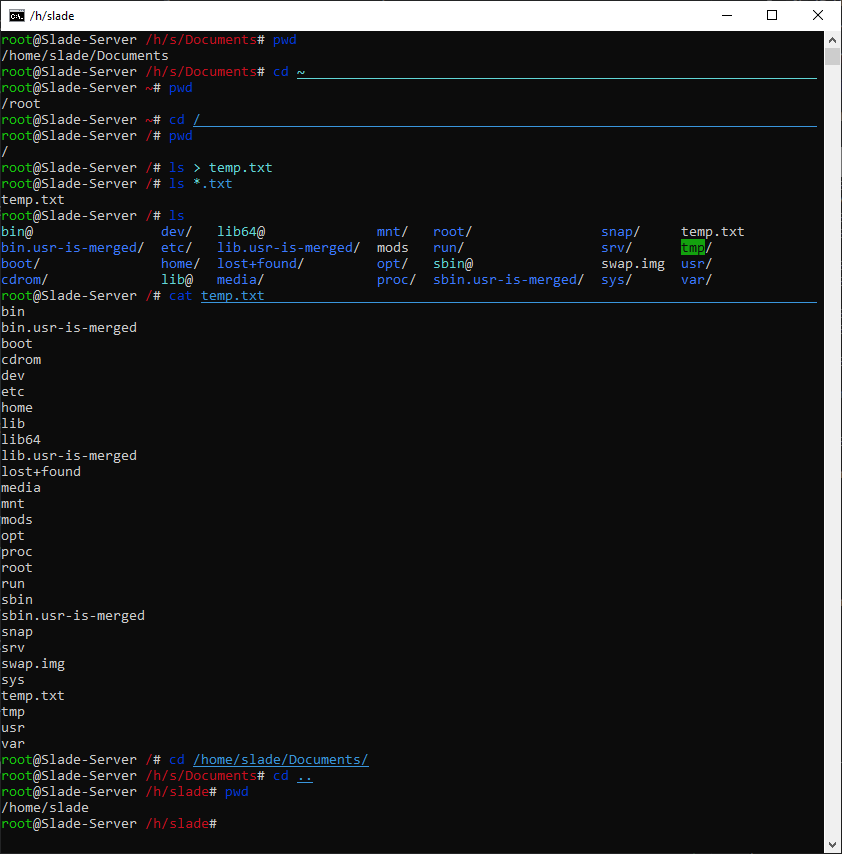
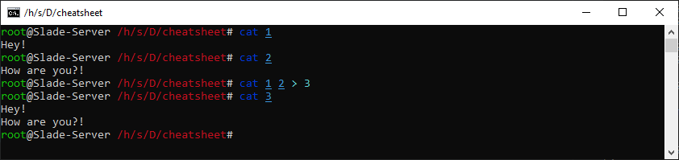
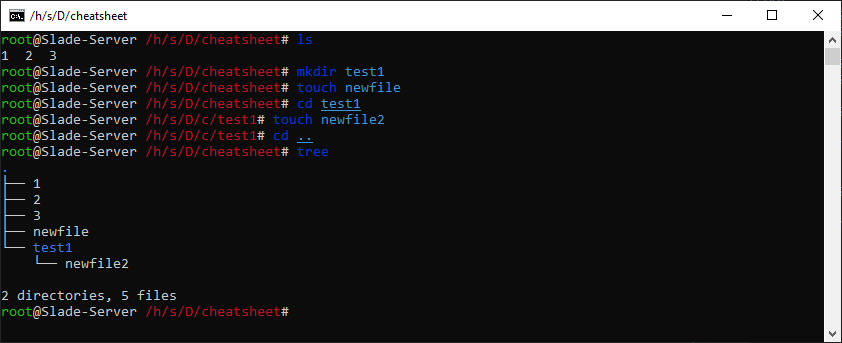
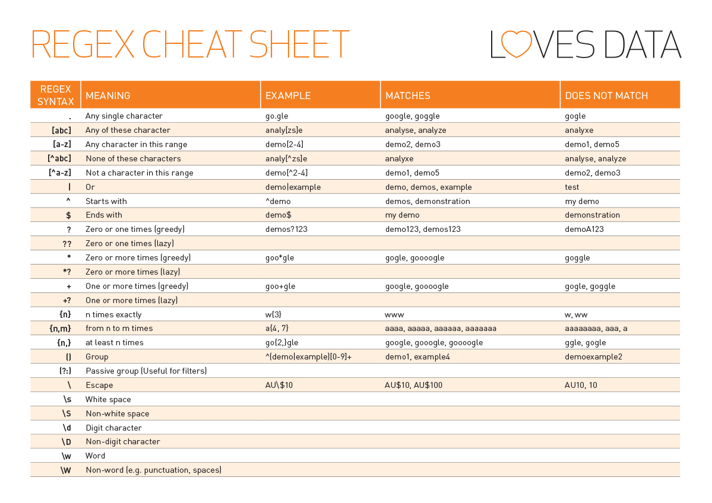
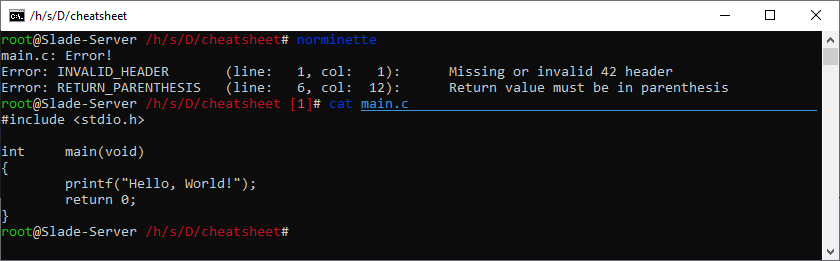
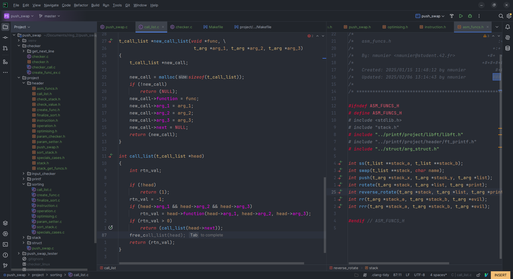

# 42_CS v1.0

## This project exists for the sole purpose of giving you enough tools to enjoy the 42 Experience while not worrying about being lost mid-journey.

## You can always submit your ideas to add in here

## ⭐ If you liked this repo, give us a star ⭐

## DON'T PING ANY CONTRIBUTORS OF THIS PROJECT.

Be kind, we are all learning here!

# Summary

Here's the summary of this project :
- [Disclaimer](#disclaimer)
- [Social Interactions](#social-interactions)
- [Tools](#tools)
  - [Terminal](#terminal)
  - [Vim](#vim)
  - [LLDB](#lldb)
  - [IDE](#ide)
- [Shortcuts list](#shortcuts-list)
- [The Piscine](#the-piscine)

## Disclaimer

A cheatsheet is a quick reference guide, not the answer to your project nor life-threatening problems.

This project is a tool. You can choose not to use it, but if you copy a finished project, you may get banned. The choice is yours.

We will talk here about projects, tools, IDEs, notions, shortcuts and others small things. 

We are a group of students that want to help, never forget to socialize;
the Piscine is made for this, the bigger the group,
the more skills will be united.
(Not necessary coding ones, it does not matter you are here to learn not to know.)

You are more than a line, a number, or a grade.
Never underestimate your inner strength and remember your humanity.
With these principles, not matter what you do, you will succeed.

### For 42 Staff
 We will not give answers to projects, just hints to look for. We want to boost confidence and help people to get better at what they do. If any of the content here is breaking the TOS of 42 school feel free to email/discord me, my intra is on my [GitHub profile](https://github.com/natReinum).

goto [Summary](#summary); (goto is not allowed at 42, if you use it, stop, it's bad)

# Social Interactions

Don't be afraid of asking for help.
Students around you were as lost as you when they started.
You'll meet people from a lot of different backgrounds.
It's a really important aspect of the school.

This section is slim because teaching manners is not the purpose of this guide but a small idea of what to do :
- be kind
- be respectful
- be on time when needed
- learn to laugh but also be serious
- accept differences, we all had a life before school, you are no one to judge
- a wrong answer is a future improvement and not a personal attack
- be wrong, you can't be always right, you'll learn way more by doing mistakes
- **be you**, the most important thing of all

Here are the websites to find your friends in clusters. 
They serve the same purpose :
- [friends42](https://friends.42paris.fr/)
- [s42](https://s42.app)
  
goto [Summary](#summary);

# Tools

Here you will find the most interesting data.
If you are in a Piscine, welcome to 42!
I advise you to carefully read this part.

The 42 logic is that you have to look for information. So don't be afraid of using Google or any search engine.

Using AI can be dangerous, be warned.
AI's generated code is a straight answer, you don't learn anything from that.
Copy-pasting code from stackoverflow is as bad as AI's code.
You can, of course, look at it, you need to start somewhere, but don't mindlessly copy and use it.
It will, in 99% of cases, fail you at the end. 

## Terminal

Your greatest ally and the most pleasant way of navigating in your system.

### Basics

Technically, the only command you need to know is ``man``.
 'Man' is short for Manual.
It will display the documentation of the command you type next. 

Exemple :
```bash
man valgrind
```

It will always be here for you when you need help with a command.

The shortcut to start a new terminal session is ``Ctrl + Alt + T``.
You can change the default terminal to the one you prefer in ``Settings → Keyboard → Shortcuts``

Use ``Tab`` for autocompletion (in ``fish``, the ``Tab`` key autocomplete the next word and ``Arrow Right`` complete the full sentence).

Small list of terminal emulator :
- ``fish``, great use of macros and shortcuts, **allowed during exams**
- ``ohmyzsh``, has colors and easy navigation between directories, **not installed during exams**
- ``GNOME Terminal``, basic but customizable
- ``Terminator``, multiple terminals in one window

### Commands

Let's go through the most important command and how the terminal behaves

When you start a terminal, by default, you start in your user directory, which is :
```bash
/home/your_user
```

It's the same when you open your explorer. From here, let's look at what you can do.

### Basic commands :
- [pwd](#-pwd-print-working-directory-)
- [ls](#-ls-list-)
- [cd](#-cd-change-directory-)
- [cat](#-cat-concatenate-)
- [mkdir](#-mkdir-make-directory-)
- [touch](#-touch-its-already-an-existing-word-)
- [tree](#-tree--)
- [nautilus](#-nautilus-perma-cc-tank-)
- [git]()

### Advanced commands :
- [chmod](#-chmod-change-mode-)
- [find](#-find--)
- [grep](#-grep-global-regular-expression-print-)
- [norminette (**PISCINERS CHECK ME OUT**)](#-norminette-its-cousin-)
- [lldb](#-lldb-low-level-debugger-)
- [valgrind](#-valgrind-the-gate-of-dead-warriors-)

goto [Summary](#summary);

## ..: pwd, print working directory :..

Use this command when you are lost in your system. It displays the path of the directory you are in.



goto [Basic_commands](#basic-commands-);

## ..: ls, list :..

It will list you the files and directories of where you are.
There are a lot of options, but we will only look at 2 of them :
- ``ls -a``, it will display all files including hidden directories/files 
- ``ls -l``, it will display a lot of information about the files in the current directory, you are invited to do your own research about this



goto [Basic_commands](#basic-commands-);

## ..: cd, change directory :..

The default explorer will, one day, never be opened again. 
This command is used to navigate between directories and directories **only**.
The syntax is :

```bash
$ cd directory/subdirectory
$ pwd
/home/your_user/directory/subdirectory
```

Now is a good time to look at some basic regarding shortcuts and wildcards.
- ``~`` is used to replace ``/home/your_user``
- ``.`` means current directory
- ``..`` signify the previous directory, you can chain them (``../../..``)
- ``/`` is the root of your hard drive, you can find the system files and so on. In Clusters and Exams you are restrained so modify and sometimes read those files
- ``>`` redirect the output of the command on the left to something (usually a file) on the right
- ``|`` allows you to redirect the output of the previous command to the next one (``cmd1 | cmd2`` will behave like ``cmd2 output_cmd1``)
- ``*`` is a very practical wildcard, it allows you to signify "everything" for exemple ``*.c`` means all ``.c`` files



(Here the wildcard ``~`` redirected me to the ``/root`` folder because I'm connected as the root user, it is the only one that behave like this)

goto [Basic_commands](#basic-commands-);

## ..: cat, concatenate :..

Its main use is to display a file. The syntax is : 

In Clusters, there is an alternative to ``cat`` to have code highlight when viewing a file : ``batcat``.

```bash
cat your_file
```

One option you might use is ``-e``, it displays non-printing characters.

(Keep in mind, you can use the full path to a file,
you don't have to be in the same directory life ``/home/other_user/Download/file.extension``)

You can also display multiple files by adding the path one after the others like ``cat path1 path2 path2``.

It's mostly used in combination with ``>`` to concatenate those files in one like ``cat file1 file2 > new_file``.



goto [Basic_commands](#basic-commands-);

## ..: mkdir, make directory :..

You now know how to navigate existing directory and files. This command creates a directory with a specified name

```bash
mkdir new_dir
```

goto [Basic_commands](#basic-commands-);

## ..: touch, it's already an existing word :..

It's almost like ``mkdir`` but for files.

You are strongly inclined to look at the documentation (``man``) of this command.

```bash
touch new_file
```



goto [Basic_commands](#basic-commands-);

## ..: tree, 🌳 :..

Like ``ls`` but better as because of its recursive use. 
The only parameter you should consider using (not considering advanced uses) is ``-a`` to display all files.

No example here, refer to the previous screenshot, it displays ``tree`` already.

goto [Basic_commands](#basic-commands-);

## ..: nautilus, perma CC tank :..

It's just the command to start the file explorer.

Use ``nautilus .`` to start the file explorer in the current directory.

goto [Basic_commands](#basic-commands-);

## ..: git, Global Information Tracker :..

You **NEED** to know how to use ``git``.

This command allows you to post your code on the intra (among other things).

The options you need to know are :
- ``git init`` - the current folder will be considered as a git repository
- ``git clone url`` - clone the giving git url (when you register for a project, you will have a link for this)
- ``git add file1 file2 ...`` - the specified file(s) will be included in your next commit
- ``git commit`` - commit the file and prepare the push. it's required to put a message so add the parameter ``-m "text"`` to specify the commit message, commits are local before push them
- ``git push`` - the files you added in all of your commit will be pushed to the server. Do this to also save your files if you ever have trouble with your session, your files will be saved in the server
- ``git status`` - the file you added with ``git add`` and the file you forgot to add will be shown

**If you are in exam, this part does not concern you.**

If you don't want to make your life difficult, register to a project and use :
- ``git clone project_url``

This way
you avoid manipulation of the upstream and your current dir will automatically push to the 42 Server.

When you ``git init``, git does not know where to push. So here what you need to do :
- add your files and create a commit (or multiple your choice)
- ``git remote add origin {url}`` - will tell you git to push to this URL (found on your project page)
- ``git push --set-upstream origin master`` - to push to the ``master`` branch

After this you can use ``git commit -m "message"`` then ``git push`` and you will be good to go.


goto [Basic_commands](#basic-commands-);

## ..: chmod, change mode :..

This command defines who can read, write, and execute a file or a directory.
There are two ways of using this command
- using number notation
- using symbolic notation

For more information about this command, read the manual (``man``).

Number notation is a combination of three numbers :
- the first one represents the rights of the owner
- the second one represents the rights of the group
- the third one represents the rights of others

Each possible right corresponds to a number :
- 0: none
- 1: read
- 2: write
- 4: execute

You can combine them to give multiple accessibility like ``6 = 4 + 2`` is ``write + execute``.

Example using number notation :

```bash
chmod 751 my_file
# gives the owner the rights to read, write and execute
# gives the group the rights to read and execute
# gives others the right to read
``` 

By mindful of who is allowed to read your files, you might have security issues.

Example with symbolic notation :

```bash
chmod u+x my_file
# gives the owner (u) the right to execute the file
```

The only parameter we will talk about is ``-R``.
It means recursive so when you use ``chmod`` on a directory it applies to each file of each subdirectory.

goto [Advanced_commands](#advanced-commands-);

## ..: find, 🔍 :..

Forgot where a file is located?
This command allows you to find this file.
Reading the documentation (``man``) is *mandatory* for this command. 

This section will give one example and inform you of the existence of this command, and that's all.

Exemple to look for every ``.h`` files in the current directory and subdirectories :

```bash
find . -name "*.h"
```

goto [Advanced_commands](#advanced-commands-);

## ..: grep, global regular expression print :..

``Grep`` is one of the most powerful text searcher tools. 
It allows you to search for text and extract it using Regular Expression patterns.

We won't go into the details of how patterns work. It's up to you to do your own research.

The basic syntax of the ``grep`` command is :
```bash
grep options pattern files
```

The options you might need are :
- ``-E``, pattern is considered as an extended regular expression
- ``-o``, will only print the matches and not the line where the matches are found.

Example to look for every word of three to five letters (only lowercase) with one or more space before and after.
```bash
grep -Eo "\s+[a-z^A-Z]{3,5}\s+" your_file
# matches :
#     hello   
#   how  
# not a match :
#     everyone
#    Hello  
```

For those interested, this is one of the common cheatsheet used :



goto [Advanced_commands](#advanced-commands-);

## ..: norminette, [its cousin](https://profile.intra.42.fr/users/norminet) :..
    
```
Currently, the Norm version used to evaluate is :           3
Currently, the norminette version used to evaluate is :     3.3.51
```
[Source](https://meta.intra.42.fr/articles/read-the-french-manual-of-42paris) last updated 10/02/25 (create an issue if it changed).

You are done with shell, let's code your first C files. 
You are learning a lot of new things, it's a bit tricky, but you manage to do everything.
You send your project to the server then... ``0, norm error``.

It can be heartbreaking.
The 42 School has a strict norm on how to code.
No matter what you think about it,
you have to respect it, it's the first thing that will be tester in each of your projects.
You can read the [PDF](https://elearning.intra.42.fr/notions/the-norm/subnotions/norm-v3/pdfs/Norm%20V3) on the Intra,
but it can get a bit repetitive to look at each line wondering if it will be correct.

So, our formidable 42 Staff created the ``norminette``, a very powerful, Python-based, tool to look at your C code.
It will tell you every line that has a problem with the Norm.

We will go through parameters in Vim to facilitate the application of the norm in the [Vim](#vim) part of this guide.

To use this command just type ``norminette`` in your terminal, and it will go through every ``.c`` and ``.h`` files in your current directory and each subdirectory.

Norm errors displayed by the norminette are quite verbose, so go through each one, you can do it!

To check the norminette version type : ``norminette -v``. It should be ``3.3.51``.

**To install the Norminette at home** 

In a Terminal with root privileges :
- Install python
```bash
sudo apt install python3
```
- Install pipx
```bash
sudo apt install pipx
```
- Install the Norminette with the correct version (3.3.51)
```bash
sudo pipx install norminette==3.3.51
```
- OPTIONAL
```bash
sudo pipx ensurepath
```
- Restart the terminal and test if the norminette is installed
```bash
norminette -v 
```



goto [Advanced_commands](#advanced-commands-);

## ..: lldb, low level debugger :..

This tool is a very complex and intricate subject, that's why we will talk about it in the [LLDB](#lldb) part of this guide.

**If you are starting to learn C, hello there, good luck. Don't spend too much time with lldb, its use comes when you debug complex projects.** 

goto [Advanced_commands](#advanced-commands-);

## ..: valgrind, the gate of dead warriors :..

**If you don't know what the ``malloc`` function does, don't bother reading this part. We even offer you a [link](#advanced-commands-) to go back.**

After going through the Norm, let's take a look at where you can fail easily: memory leaks.

Here's a little trick for you, if a project allows ``malloc`` but doesn't talk about ``free``, you don't need to use valgrind.

So, now that you are sure that you need to use valgrind, let's learn.

Valgrind is a memory checker tool. It is used to search for leaks in your code.

When you use the ``malloc`` function, you 'reserve' space in your memory. 
The ``free`` function undo this operation to allow this space to be used again.
Forgetting to ``free`` memory space will create leaks,
even is you have only one leaked byte in your project, **your final score will be 0**.

Valgrind is your best friend, or a black crow depending on when you execute it.
It will show you how many bytes you lost during the execution of your project.
Don't be afraid about big numbers, a ``malloc`` in a loop can do a lot.

If you are here, you know how to compile. When you compile your project, add the ``-g2`` (``-g3`` is overkill) flag.
Then when using valgrind add the ``--leak-check=full`` flag. Valgrind will print the lines where the ``malloc`` function was used and so you can deduct which var was not freed.

Exemple :

main.c
```C++
#include <stdlib.h>
#include <stdio.h>

int main(int argc, char **argv)
{
    char    *param_array;
    
    if (argc < 2)
        return (1);
    param_array = malloc((argc - 1) * sizeof(int));
    if (!param_array)
        return (1);
    *param_array = *(*++argv);
    printf("%c\n", param_array[0]);
    return (0);
}
```

Let's compile with flags :
```bash
cc -Werror -Wall -Wextra -g2 main.c -o leaks
```

Then valgrind the output :
```bash
valgrind --leak-check=full ./leaks "Hey"
```

We will just look at the interesting lines, so keep in mind this is **NOT** the exact output of valgrind ;
```
==21559== HEAP SUMMARY:
==21559==     in use at exit: 4 bytes in 1 blocks
==21559==   total heap usage: 2 allocs, 1 frees, 1,028 bytes allocated
==21559== 
==21559== 4 bytes in 1 blocks are definitely lost in loss record 1 of 1
==21559==    at 0x4846828: malloc (in /usr/libexec/valgrind/vgpreload_memcheck-amd64-linux.so)
==21559==    by 0x10919C: main (main.c:10)
==21559== 
==21559== LEAK SUMMARY:
==21559==    definitely lost: 4 bytes in 1 blocks
```

We can observe that we have lost four bytes.
If we want to get technical, we lost a ``sizeof(int)``.
We lost our memory from a ``malloc`` at the address ``0x10919C`` or,
using words we comprehend, in the file ``main.c`` at line 10.

Line 10 :
```C++
    param_array = malloc((argc - 1) * sizeof(int));
```

So, here is the corrected version of ``main.c`` :
```C++
#include <stdlib.h>
#include <stdio.h>

int main(int argc, char **argv)
{
    char    **param_array;
    
    if (argc < 2)
        return (1);
    param_array = malloc((argc - 1) * sizeof(int));
    if (!param_array)
        return (1);
    *param_array = *(*++argv);
    printf("%c\n", param_array[0]);
    free(param_array); // ####### our fix #######
    return (0);
}
```

Let's run our test again :
```bash
cc -Werror -Wall -Wextra -g2 main.c -o noleaks | valgrind --leak-check=full ./noleaks "Hey"
```

No leaks !!
```
==22530== HEAP SUMMARY:
==22530==     in use at exit: 0 bytes in 0 blocks
==22530==   total heap usage: 2 allocs, 2 frees, 1,028 bytes allocated
```

Happy debug. It's not always that simple, but with perseverance you can do it!

goto [Advanced_commands](#advanced-commands-);

# VIM

### Disclaimer

Vim is better than Nano if you think it's not the case you can be right if your tier list is :
``Neovim > Vim > Nano``.

In conclusion, we won't talk about Neovim because it's vim but improved. 
And we won't talk about Nano because it's Nano.

## Introduction

Vim is a terminal text editor.
It is very customizable and has a lot of tricks.
This guide will not be an exhaustive list of all the wonderful options Vim has.

First of, Vim is allowed in exam.
Neovim is not and Nano is Nano (if you really want to use it, yes, it's also allowed in exam).

We will talk about exams but not here.
Know that you are allowed to modify the Vim config file, but it's not very useful in exams, only in clusters.

## Summary
- [Configuration](#configuration)
- [Getting started](#getting-started)
- [Vim Shortcuts](#vim-shortcuts)

### Configuration

The Vim configuration can be huge.
If you install plug-ins,
then add custom commands, and so on your files will be hundreds of lines.

**During the Piscine, we advise you to not over modify your config file. 
Try to keep your environment as close as the one in exam to avoid being lost with default parameters**.
We will give you a base don't worry.

To modify your configuration, you'll need to take a look at the ``vimrc`` file.

In a terminal :
```bash
vim ~/.vimrc
```

If the file was not already created, vim will create it for you. Yes, you need to put the ``.`` before the ``vimrc``.

You should have an empty file now. Let's take a look at the options you are recommended to use :
- ``syntax on`` - highlights your code
- ``set number`` - displays the line number, useful when you are debugging or correcting the norm
- ``set relativenumber`` - display line number relative to the cursor, in combination with ``set number``, you will have the line number then the relative lines number
- ``set tabstop=4`` - sets the number of spaces for one tab, useful to validate the norm
- ``set shiftwidth=4``- sets the number of spaces for the autoindent function, useful when you want to have a nice looking code while respecting the norm
- ``set softtabstop=0 noexpandtab`` - two option in one line, the first one forces the number of spaces in a tab to be 0 (you want the tab character not the space one), the second one forces the tab key to insert the tab character
- ``set autoindent`` - it's verbose, it enables the autoindent function in your code
- ``set mouse=a`` - controversial one, allows you to move the cursor using the mouse 

Here what your ``.vimrc`` could look like during your Piscine and also after :
```bash
syntax on
set number
set relativenumber 
set tabstop=4
set shiftwidth=4
set softtabstop=0 noexpandtab
set autoindent
set mouse=a
```

To exit and save your file, type ``:x`` (you can see it on the bottom left). You will need to restart your vim or source the configuration file in Vim like so : ``:source ~/.vimrc``.

### Getting started

Vim is now your favorite terminal-based text editor. 
You start by hating on it for the strange way of handling files, 
but you get used to it, and now you have Vim shortcuts in your IDE.

When you open a file, you are in normal mode. There are three main modes :
- Normal (``Esc`` to go back to this mode), it's like viewing a file, you can use some shortcuts in this mode, you can also type commands
- Visual (``v`` key), it's the mode to select stuff, copy, and so on
- Insert (``i`` key), you can now edit the file, use arrows and

You can also use the mode ``Replace``,
but it's not that useful and few people use it anyway.

If you are not in ``Insert`` mode, you won't be able to change anything.
When entering ``Visual`` mode, the selection starts where the cursor currently is, that's why the ``Normal`` mode exists.

Now that you are stuck in the Vim editor, follow the guide to know what to do.

### Vim Shortcuts

In ``Normal`` mode :
- ``i`` - enter ``Insert`` mode
- ``v`` - enter ``Visual`` mode
- ``u`` - undo, like ``Ctrl + Z`` in IDEs and most software like Word
- ``:w`` - write, will save the file where the cursor is
- ``:q`` - quit, quit Vim, but does not save (you will see a warning or use ``:wq``)
- ``!`` - forces an operation, like force quit ``:q!``
- ``:!{shell_cmd}`` - allows you to execute shell commands in vim like ``:!ls``
- ``:x`` - it's like ``:wq``
- ``:{range}s/pattern/replacement/{flag}`` - allow you to replace in your file a pattern, this one deserves a section :
  - ``{range}`` - correspond to the lines to look for :
    -  ``%`` is the entire file
    - ``start,end`` are the line to start and end the search (``1,5`` for exemple for lines 1 to 5) 
    - ``.`` or no ``{range}`` is current line 
  - ``pattern`` is the regexp pattern to look for (cf. [grep](#-grep-global-regular-expression-print-))
  -  ``replacement`` is the characters to replace the pattern with
  - ``{flag}`` can be combined :
    - ``g`` means global replacement (in the line)
    - ``c`` to confirm the change (keys will be displayed at the bottom)
    - ``i`` case-insensitive matching (if you don't know what it means Google it)
    - ``I`` case-sensitive matching
    - ``e`` avoid display of errors
- ``:line_number`` - go to ``line_number`` (``:42`` will teleport the cursor to line 42)
- ``:vs file_path`` - vertical split, puts the current file on the right and the new file on the left
- ``:sp file_path`` - horizontal split, puts the current file at the bottom and the new file on the top (you can mix it with ``:vs`` as much as you want)
- ``Ctrl + w w`` - navigate between splits in a clockwise pattern
- ``Ctrl + w W`` - navigate between splits in a counter-clockwise pattern
- ``Ctrl + w h`` - move to the window on the left
- ``Ctrl + w j`` - move to the window below
- ``Ctrl + w k`` - move to the window above
- ``Ctrl + w l`` - move to the window on the right.
- ``Ctrl + z`` - puts vim as a background task (to resume, in the same terminal type ``fg``)
- ``:tabnew file_path`` - opens a file in a new tab
- ``g t`` - go to next tab
- ``g T`` - go to previous tab
- ``yy`` - copy current line
- ``dd`` - delete current line (maintain second ``d`` to keep deleting)
- ``p`` - paste copied **OR** deleted line (if you ``yy`` then ``dd`` a different line you will paste the second one)
- ``PageUp``/``PgUp`` moves the cursor up a page
- ``PageDown``/``PgDn`` moves to cursor down a page

For more shortcuts, google them.

goto [Summary](#summary);

# LLDB

The acronym means "Low Level Debugger." 

It's invaluable if your code fails to execute properly, and you don't know why.

**Before you ask, yes, it's installed and allowed in exams!**

First you need to compile your program using the ``-g2`` (or ``-g3``) flag.

Exemple :
```bash
cc -Wall -Wextra -Werror -g3 your_prog.c -o your_executable
```

To be clear the ``-o output_name`` flag is optional.

If you don't use the ``-g2`` flag you will end up debugging the assembly of your code.
You don't know what it is? Keep your sanity, you don't want to learn about x64dbg, registers, and memory injections.

To start debugging, launch your program like so :
```bash
lldb your_executable param1 param2 param3
```

(You don't always have parameters, it's for this example)

You are now in the lldb program.
Here are the most useful shortcuts,
if you want an extended list, you can always google it :
- ``b {function_name}`` - breakpoint will stop the program when starting to execute the function you specified (``b main`` will debug starting the main function)
- ``q`` - quits
- ``r`` - run the program
- ``n`` - next line
- ``s`` - step into, if you are on a line without a function you coded, it will do nothing, otherwise the cursor will jump into your function
- ``gui`` - start the GUI (Graphical User Interface) of LLDB, in this mode ``n`` and ``s`` works, but you don't have to press entering, shortcuts are displayed at the start of the gui mode, to quit it, press ``Esc``

In GUI mode, you have three main parts.
On the bottom you have your variables and their value,
on the right you have the Threads,
don't be scared,
the part you will mostly look at is your code and your variables.

There are not a lot of useful tips to give other than :
- know what your functions should return
- are your variables initialized?
- is your malloc protected?
- do you free after you used your variable?
- are you sure you read the subject and understood it (I have never ever in my life forgotten to add the ``\n`` at the end of a line, yeah I didn't read the end of the subject)

goto [Summary](#summary);

# IDE

*Integrated Development Environment*

## Disclaimer for Pisciners

The **ONLY** IDE you are allowed to use is Vscode. You can skip this part and return to the [Summary](#summary).

## What are the best ones?

Let's have a controversial opinion. Vscode sucks. Now that ready to write the best explanations about why this guide is totally biased and useless, keep reading and then write your opinion.

We will cover only two choices if you are already familiar with another one
and you don't want to change it's totally fine.

## Visual Studio Code (vscode)

A very light, powerful, customizable and extendable option.

Even if you read a shocking phrase about it, it's not that bad. 

The downside and why the other option exists is
that because it's made to be customizable to the bone,
it's not focused on C.

Keep using it if you like it,
if you want something so powerful it solves world hunger (it does not),
keep reading.

## Clion

*"The best IDE I have ever used, the reason I can still debug with passion" - nmunier*

Why is this one better, according to the red head coder above?

The debugger is overpowered!
You have access to so much possibility including modifying variables,
calculating the value of calls before execution.
Try it.

The autocompletion is smart. You gain a lot of time when you know what you are coding. Be careful with it otherwise it's a huge time saver.

There are a lot of plugins and options to customize this IDE,
close to the level of vscode.

It is technically free for us. Create a GitHub account (you will need it anyway in the future) then apply for the GitHub student pack ([link here](https://meta.intra.42.fr/articles/read-the-french-manual-of-42paris)) then connect it to your JetBrains account. It's free as long as you are a student.

Test it if you want, if you like it, then customize it to your licking!



goto [Summary](#summary);

# Shortcuts list

Here's the list of all shortcuts used in this guide. The explanations are quick and it's the goal. Have fun at 42 School.

There are a lot of Copy-Paste if you read all the guides,
it's the purpose of this part, concatenate all the shortcuts in one place.

### For Pisciners :

Copy this if you want, memorize it if it's important to you. 
No matter what you do, keep in mind life is about social experiences not ``char`` on a screen. 
We all started somewhere, if you really desire to compare yourself, do it to your pass self. 
Have fun, "drink milk" ([Dani](https://www.youtube.com/@Danidev)) and "may the flame guide thee" (Firekeeper).

Shortcuts for :
- [System](#system-shortcuts)  
- [Terminal](#terminal-shortcuts)
- [Vim](#vim-shortcuts)

## System Shortcuts
- ``Alt + Tab``: next application
- ``Alt + Shift + Tab``: previous application
- ``HomeKey + ArrowRight``: moves the current window to the right
- ``HomeKey + ArrowLeft``: moves the current window to the left
- ``HomeKey + ArrowUp``: fullscreen
- ``HomeKey + ArrowDown``: quit fullscreen
- ``HomeKey``: search and desktops
- ``HomeKey + HomeKey``: application list

## Terminal Shortcuts
- ``Ctrl + Alt + T``: opens a new terminal instance
- ``Ctrl + Shift + T``: opens a new tab in the current terminal instance
- ``Ctrl + PgUp``/``Ctrl + PgDn``: navigates between tabs in the current terminal instance
- ``Ctrl + C``: sends the SIGINT signal to the current running process (stops it)
- ``Ctrl + Z``: suspends the current process (``fg`` command to resume)
- ``Ctrl + Shift + C``: copies the selection
- ``Ctrl + V``: pastes the clipboard

## Vim Shortcuts
In ``Normal`` mode :
- ``i`` - enter ``Insert`` mode
- ``v`` - enter ``Visual`` mode
- ``u`` - undo, like ``Ctrl + Z`` in IDEs and most software like Word
- ``:w`` - write, will save the file where the cursor is
- ``:q`` - quit, quit Vim, but does not save (you will see a warning or use ``:wq``)
- ``!`` - forces an operation, like force quit ``:q!``
- ``:!{shell_cmd}`` - allows you to execute shell commands in vim like ``:!ls``
- ``:x`` - it's like ``:wq``
- ``:{range}s/pattern/replacement/{flag}`` - allow you to replace in your file a pattern, this one deserves a section :
  - ``{range}`` - correspond to the lines to look for :
    -  ``%`` is the entire file
    - ``start,end`` are the line to start and end the search (``1,5`` for exemple for lines 1 to 5) 
    - ``.`` or no ``{range}`` is current line 
  - ``pattern`` is the regexp pattern to look for (cf. [grep](#-grep-global-regular-expression-print-))
  -  ``replacement`` is the characters to replace the pattern with
  - ``{flag}`` can be combined :
    - ``g`` means global replacement (in the line)
    - ``c`` to confirm the change (keys will be displayed at the bottom)
    - ``i`` case-insensitive matching (if you don't know what it means Google it)
    - ``I`` case-sensitive matching
    - ``e`` avoid display of errors
- ``:line_number`` - go to ``line_number`` (``:42`` will teleport the cursor to line 42)
- ``:vs file_path`` - vertical split, puts the current file on the right and the new file on the left
- ``:sp file_path`` - horizontal split, puts the current file at the bottom and the new file on the top (you can mix it with ``:vs`` as much as you want)
- ``Ctrl + w w`` - navigate between splits in a clockwise pattern
- ``Ctrl + w W`` - navigate between splits in a counter-clockwise pattern
- ``Ctrl + w h`` - move to the window on the left
- ``Ctrl + w j`` - move to the window below
- ``Ctrl + w k`` - move to the window above
- ``Ctrl + w l`` - move to the window on the right.
- ``Ctrl + z`` - puts vim as a background task (to resume, in the same terminal type ``fg``)
- ``:tabnew file_path`` - opens a file in a new tab
- ``g t`` - go to next tab
- ``g T`` - go to previous tab
- ``yy`` - copy current line
- ``dd`` - delete current line (maintain second ``d`` to keep deleting)
- ``p`` - paste copied **OR** deleted line (if you ``yy`` then ``dd`` a different line you will paste the second one)
- ``PageUp``/``PgUp`` moves the cursor up a page
- ``PageDown``/``PgDn`` moves to cursor down a page

goto [Summary](#summary);

# The Piscine

This part is to give you confidence not answers. 

## Prerequisite

None.
Sleep, drink water and have a good calorie intake (eat), and you are good to go.
Having a fixed sleep schedule helps
(not necessary a classic one, 9–17h is as good as 20–8h if you are efficient in both cases).
Be aware, having an offset sleep schedule can be detrimental to attend properly to the exams.

You will need to create a [Discord](https://discord.com/) for the online part of the school.
Having a [GitHub](https://github.com/) is handy, you are advised to have one.

## Planing

**We will consider you already are subscribed to a Piscine. We will not talk about how to create an account and register.**

A Piscine is the exam to be able to enter the 42 School. 
It starts on a monday and ends on a friday for a total time of 26 days.

They are three important things to consider :
- ``Module``, you need to complete as many of them as possible in this timespan, don't stress, do what you can do, you are here to learn
- ``Exam``, there are four of them, always on friday from 16–20h for the first 3 then the last one is the final exam and lasts 8h
- ``Rush``, there are three rushes, a rush starts on friday night (usually after the exam), and it ends at 23:42 on sunday

You will learn more about them in the following parts; this section is to talk about planning.

If we consider that you chose to do the three rushes (don't skip exams,
well you can, but it's up to you if you want to be accepted).

|            |          Monday           |          Tuesday          |         Wednesday         |         Thursday          |                      Friday                       |         Saturday         |          Sunday          |
|:----------:|:-------------------------:|:-------------------------:|:-------------------------:|:-------------------------:|:-------------------------------------------------:|:------------------------:|:------------------------:|
| **Week 1** | $${\color{green}module}$$ | $${\color{green}module}$$ | $${\color{green}module}$$ | $${\color{green}module}$$ | $${\color{green}module}$$ + $${\color{red}exam}$$ | $${\color{yellow}rush}$$ | $${\color{yellow}rush}$$ |
| **Week 2** | $${\color{green}module}$$ | $${\color{green}module}$$ | $${\color{green}module}$$ | $${\color{green}module}$$ | $${\color{green}module}$$ + $${\color{red}exam}$$ | $${\color{yellow}rush}$$ | $${\color{yellow}rush}$$ |
| **Week 3** | $${\color{green}module}$$ | $${\color{green}module}$$ | $${\color{green}module}$$ | $${\color{green}module}$$ | $${\color{green}module}$$ + $${\color{red}exam}$$ | $${\color{yellow}rush}$$ | $${\color{yellow}rush}$$ |
| **Week 4** | $${\color{green}module}$$ | $${\color{green}module}$$ | $${\color{green}module}$$ | $${\color{green}module}$$ |       $${\color{orange}final \space exam}$$       |            ❌             |            ❌             |

Are you looking for the subjects? Don't. 

You want to be prepared like never before? Go read the [prerequisite](#prerequisite) section.

You are expected to don't know anything about coding. 
This school will give you the tools to be a good programmer. 

For example, nbesnard didn't know how to code at all. He learned a lot and is now a great novice programmer.

Failing a Piscine is not the end; you can still do another one, one year after.
That's the case of vrosse-d, so don't be scared to retry!
**You are limited to two Piscine in your life.**

## Modules

We will not cover the content of any modules, just some tips.

Modules cover a bit of Shell and the programming language ``C``.

Subject are on your Intra.
Do them in order and when you finish one, look for a correction.
Manager your corrections and slot.
People will work at the same speed as you, it is sometimes hard to find points or use them.
The last week is usually full of point exchange and the second and third are mixed. 

If you think this is incomplete, feel free to tell us!
- Read the entire exercise before doing it.
- Ask around you and search on the internet for hints not the answer right away.
- Look at the functions you are allowed to use, they are usually the clues to succeed.
- Don't use ChatGPT, at least use [Mistral](https://chat.mistral.ai/chat), it is way better, **NEVER** ask for answers, ask for documentation and explanations.
- If you want to be accepted, don't look for GitHub with answers
- Be very meticulous about what file to turn in and where to put them. A missing file will KO you and one unwanted file also.
- If you feel overwhelmed, lost, tired or anything like so. Take a break, go home, relax and come back the next day. You are totally allowed to take a day off.
- A good idea on how to succeed is to come every day for 7h. If you do while working properly, you will succeed.
- Social interactions will carry you and make you a better coder. It will also help you to be selected.

## Exams

Still no answers.

Exams are only in ``C``, no Shell.

They last from 4pm to 8pm except the last one, which lasts from 10am to 6pm.

We will answer the question "What to do in exams?"

1. Subscribe to the project and to the event on the Intra
2. Be there on time, 1 min late and you are out
3. Don't cheat, you will get caught and banned
4. Wait for the audio cue (played too much FNAF) to start the exam. It will be on screen, but to connect do not use your login and password :
   - login : ``exam``
   - password : ``exam``
5. Open a terminal and type ``examshell``, it will ask for your login and password (**the password will not be shown when typing it, don't worry, it's still registering your input**).
6. After 15 minutes, if you are not connected, you will be asked to leave the room
7. A picture will appear on your desktop, **DO NOT CLOSE IT** except at the end obviously
8. Read the terminal, it will tell you where to go and what exercise you are on.
9. The subject are in ``Documents/subject/exercise_name`` and you have to put your files in ``Documents/rendu/exercise_name``
10. Use [VIM](#vim) (or nano if you really want) to code, test your code, use [LLDB](#lldb), watch out to delete your tests before submitting your file(s)
11. When you are sure you are right, you can commit and push using ``git`` (cf. [git](#-git-global-information-tracker-)) then type ``grademe``, in the terminal you use ``examshell`` in, to start the correction
12. Now two things can happen :
    - $${\color{green}Success}$$: nothing to do, go to the next exercise
    - $${\color{red}Failure}$$: you will have a trace of your error, read your terminal for more info (**no trace during the final exam**), try to find you error, the more you fail the more time you will need to wait between each ``grademe`` command so don't spam

Some more tips :
- If you close your picture during the exam, it's the end of it. You can exit the room.
- If you close your terminal you typed ``examshell`` in, you can open new one and re-type ``examshell``,
you will resume your previous session.
- You will be able to go to the restroom every hour.
- If you have questions, stand up and wait.
- You are allowed to use a mechanical watch. You can bring empty paper (two sheets max), a pen and a bottle of water (on the ground).
- If you have something in your pockets, even a forgotten old bill, **you will be expelled from the exam.**

## Rushes

They are three of them.

They will make you work on your team building skills.
Be kind and interested in the project even if it's not that difficult.

It's a way to gain votes and meet new people. They will be chosen by the server.

You are really inclined to participate in, at least, one of them. Two is better.

If you don't succeed, it isn't bad; you are sometimes expected to fail as a group to learn who you are.

BSQ is sort of a rush, you will be able to choose your partner. It's optional, don't do it if you have modules to finish.

# ***Good luck, you can do it !***
