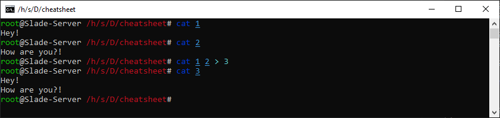

# ..: cat, concatenate :..

Its main use is to display a file. The syntax is :

In Clusters, there is an alternative to ``cat`` to have code highlight when viewing a file : ``batcat``.

```bash
cat your_file
```

One option you might use is ``-e``, it displays non-printing characters.

(Keep in mind, you can use the full path to a file,
you don't have to be in the same directory life ``/home/other_user/Download/file.extension``)

You can also display multiple files by adding the path one after the others like ``cat path1 path2 path2``.

It's mostly used in combination with ``>`` to concatenate those files in one like ``cat file1 file2 > new_file``.



You should check the options as always with the command ``man``.
