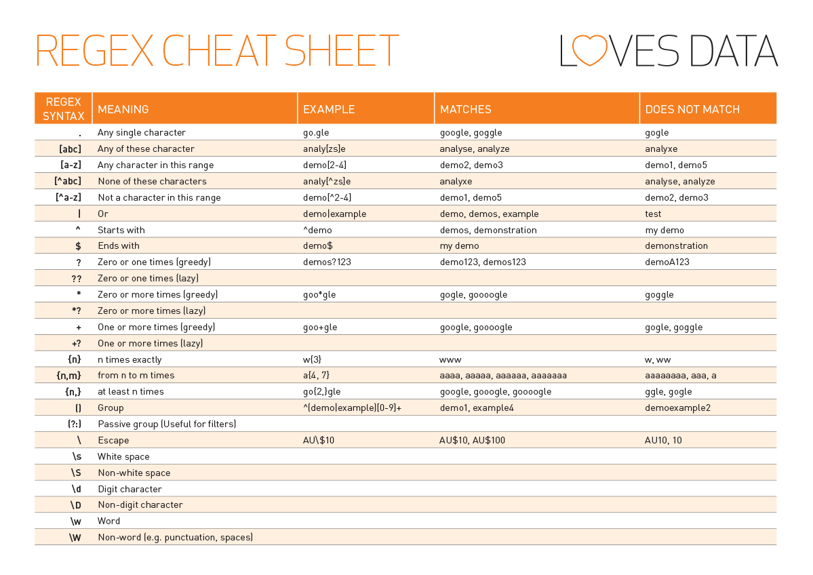

# ..: grep, global regular expression print :.

``Grep`` is one of the most powerful text searcher tools.
It allows you to search for text and extract it using Regular Expression patterns.

We won't go into the details of how patterns work. It's up to you to do your own research.

The basic syntax of the ``grep`` command is :
```bash
grep options pattern files
```

The options you might need are :
- ``-E``, pattern is considered as an extended regular expression
- ``-o``, will only print the matches and not the line where the matches are found.

Example to look for every word of three to five letters (only lowercase) with one or more space before and after.
```bash
grep -Eo "\s+[a-z^A-Z]{3,5}\s+" your_file
# matches :
#     hello   
#   how  
# not a match :
#     everyone
#    Hello  
```

For those interested, this is one of the common cheatsheet used :



You should check the options as always with the command ``man``.
