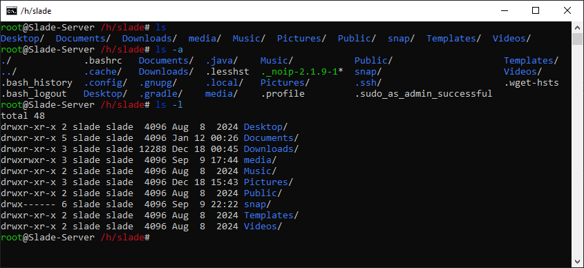

# ..: ls, list :..

It will list you the files and directories of where you are.
There are a lot of options, but we will only look at 2 of them :
- ``ls -a``, it will display all files including hidden directories/files
- ``ls -l``, it will display a lot of information about the files in the current directory, you are invited to do your own research about this

Other options exist. You are encouraged to look for them (``man`` command), you may need them in the future.
