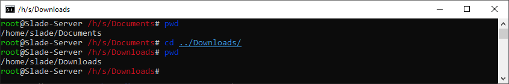

# ..: pwd, print working directory :..

Use this command when you are lost in your system. It displays the path of the directory you are in.

There are few options to this. If you are curious use the ``man`` command.
