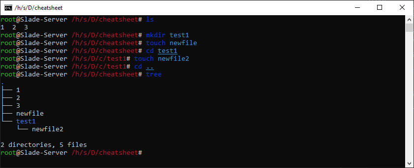

# ..: touch, it's already an existing word :..

It's almost like ``mkdir`` but for files.

You are strongly inclined to look at the documentation (``man``) of this command.

```bash
touch new_file
```


