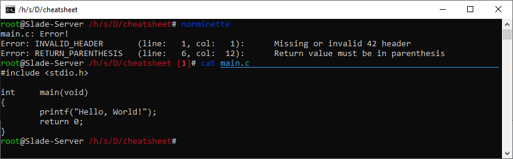

# ..: norminette, [its cousin](https://profile.intra.42.fr/users/norminet) :..

```
Currently, the Norm version used to evaluate is :           3
Currently, the norminette version used to evaluate is :     3.3.51
```
[Source](https://meta.intra.42.fr/articles/read-the-french-manual-of-42paris) last updated 10/03/25 (create an issue if it changed).

You are done with shell, let's code your first C files.
You are learning a lot of new things, it's a bit tricky, but you manage to do everything.
You send your project to the server then... ``0, norm error``.

It can be heartbreaking.
The 42 School has a strict norm on how to code.
No matter what you think about it,
you have to respect it, it's the first thing that will be tester in each of your projects.
You can read the [PDF](https://elearning.intra.42.fr/notions/the-norm/subnotions/norm-v3/pdfs/Norm%20V3) on the Intra,
but it can get a bit repetitive to look at each line wondering if it will be correct.

So, our formidable 42 Staff created the ``norminette``, a very powerful, Python-based, tool to look at your C code.
It will tell you every line that has a problem with the Norm.

To use this command just type ``norminette`` in your terminal, and it will go through every ``.c`` and ``.h`` files in your current directory and each subdirectory.

Norm errors displayed by the norminette are quite verbose, so go through each one, you can do it!

To check the norminette version type : ``norminette -v``. It should be ``3.3.51``.

**To install the Norminette at home**

In a Terminal with root privileges :
- Install python
```bash
sudo apt install python3
```
- Install pipx
```bash
sudo apt install pipx
```
- Install the Norminette with the correct version (3.3.51)
```bash
sudo pipx install norminette==3.3.51
```
- OPTIONAL
```bash
sudo pipx ensurepath
```
- Restart the terminal and test if the norminette is installed
```bash
norminette -v 
```

Example of something that would get an immediate 0 when correcting:


